##  Core Expertise

- **DevOps & Infrastructure Automation**  
- **Full‑Stack Application Development**  
- **Simulation Engines & Warehouse Modeling**  
- **Warehouse Optimization**  
- **Business Process Mapping & Data Modeling**  

Pull requests and issue reports welcome - let’s turn complexity into clarity.

---

## Development Metrics

---
<table border="0" cellpadding="12" cellspacing="0" align="center">
  <tr>
    <td align="center" valign="middle">
      
    </td>
    <td valign="middle">
      <blockquote style="margin:0 0 0 20px;">
        “In the face of code, even time bleeds - and that which slumbers in the depths of logic stirs with every commit…”
      </blockquote>
    </td>
  </tr>
</table>

